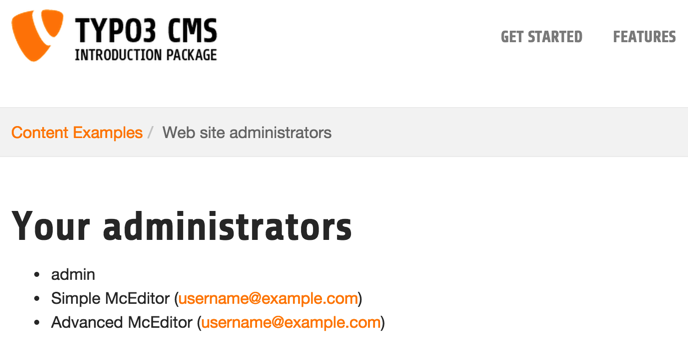

.. ==================================================
.. FOR YOUR INFORMATION
.. --------------------------------------------------
.. -*- coding: utf-8 -*- with BOM.

.. include:: ../Includes.txt

.. _appendix-a:

Appendix A – Tutorial answers
-----------------------------

Here are the steps that were needed to improve the display of the
e-mail address:

#. edit the HTML so that the :code:`###FIELD.email###` marker is just next to the
   :code:`###FIELD.realName###` marker

#. change the type of the field to "Text"

#. enter the following TypoScript configuration:

   .. code-block:: typoscript

      typolink.parameter.field = email
      required = 1
      noTrimWrap = | (|)|

The "mailto:" link is now built using the typolink property of the
TEXT object. We use the fact that the record's data is loaded into the
content object to retrieve the e-mail address using the :code:`field`
property. We also make the field value required, so that nothing gets
displayed when it's empty. The brackets are added using the
:code:`noTrimWrap` property in order to also include a blank space before
the opening bracket.

As mentioned before, the result should be as follows:

	The final result in the frontend, with empty brackets removed

