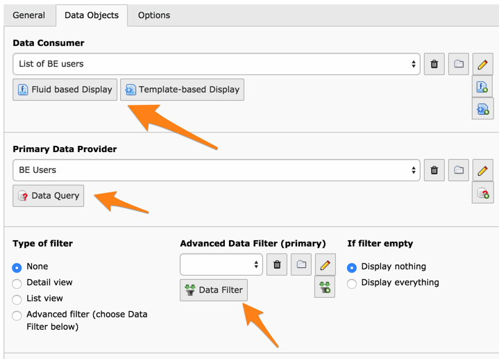

.. ==================================================
.. FOR YOUR INFORMATION
.. --------------------------------------------------
.. -*- coding: utf-8 -*- with BOM.

.. include:: ../Includes.txt

.. _faq:

Frequently Asked Questions
--------------------------

.. _faq-troubleshooting:

Troubleshooting
^^^^^^^^^^^^^^^

Q: When I save my Display Controller, I lose the data provider and the data consumer. What's going wrong?
  A: This is generally due to the order in which the extensions are
  installed: "displaycontroller" must be loaded before any of the data
  providers, data consumers or data filters. You should normally see
  some information about allowed record types in the Display Controller
  input form (see screenshot below). If you don't, there's an
  installation problem.

Allowed record types for Display Controller components

