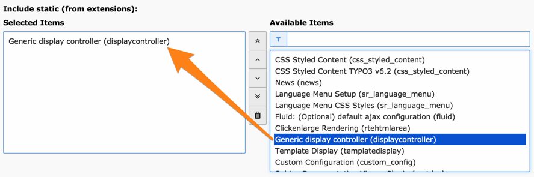

.. ==================================================
.. FOR YOUR INFORMATION
.. --------------------------------------------------
.. -*- coding: utf-8 -*- with BOM.

.. include:: ../Includes.txt

.. _installation:

Installation
------------

The Display Controller must be installed as part of the Tesseract
suite of extensions. It is useless outside of this scope.

The extension will add a number of fields to the tt\_content table and
creates a new table used to store the relations between the various
Tesseract components.

After installation the static TypoScript template provided by
the extension should be added to the site's template.

	Including the static template provided by Display Controller

.. _installation-compatibility:

Compatibility
^^^^^^^^^^^^^

As of version 2.0.0, TYPO3 CMS 7 or more is required. Use version 1.6.x for TYPO3 CMS 6.2

.. _installation-configuration:

Configuration
^^^^^^^^^^^^^

Here are the configuration options available after installing the
extension:

Debug
  Choose the type of debugging that you want.
  Debugging to the output will display status messages right before the
  Display Controller's normal output in the frontend (see screenshot
  below). Debugging to the Developer's Log will log messages provided
  you have an extension enabling that log (such as "devlog"). It's also
  possible to debug to both. Choosing "None" will turn all debugging
  off.Debugging can also be activated on a content element basis (see
  User Manual below).The icons show the status. Rolling over displays
  the debug title and message (including the key of the extension which
  registered the message). Clicking on an icon will dump any extra debug
  data to the JavaScript console.

  .. figure:: ../Images/FrontendDebugOutput.png
     :alt: Debug output in the frontend

     Debug markers in the frontend and output in the console

Minimum level for debugging
  Only message with the chosen level
  of severity or above will be logged for debugging. All others are
  ignored. This makes for a less verbose output.

Debug output class
  This makes it possible to create a custom
  class for rendering the debug output. This class will be used instead
  of :code:`\Tesseract\Displaycontroller\Utility\Debugger`. It
  **must** extend :code:`\Tesseract\Displaycontroller\Utility\Debugger` and override
  the :code:`render()` method.
