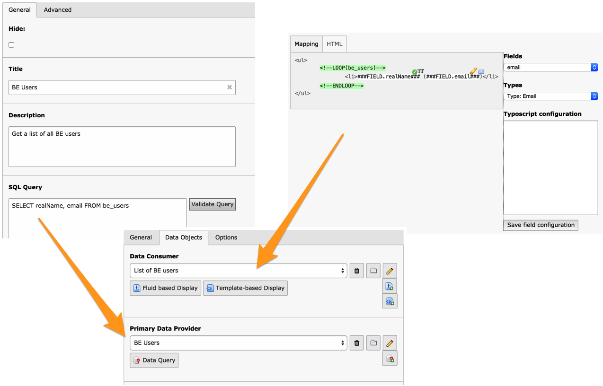

.. ==================================================
.. FOR YOUR INFORMATION
.. --------------------------------------------------
.. -*- coding: utf-8 -*- with BOM.

.. include:: ../Includes.txt

.. _introduction:

Introduction
------------

This extension is a FE plugin for the Tesseract Project. It connects a
Data Consumer with one or more Data Providers and Data Filters in
order to display data in the TYPO3 FE.

If this sounds like gibberish please go straight to the Tutorial
chapter of this manual which explains all the basic concepts. For an
even quicker introduction you can refer to the tutorial screencast
found on the Tesseract web site (http://typo3-tesseract.com/).

.. _introduction-screenshot:

Screenshot
^^^^^^^^^^

An example of the power of the Tesseract Project: a SQL-based query, a
HTML template with a point-and-click mapping interface, the Display
Controller to relate these two components together, and a result in
the frontend.

	A Display Controller content elements and its relation to two Tesseract components

.. _introduction-questions:

Questions?
^^^^^^^^^^

If you have any questions about this extension, you may want to refer
to the Tesseract Project web site http://www.typo3-tesseract.com/
for support and tutorials. You
may also ask questions in the TYPO3 English mailing list
(typo3.english).

.. _introduction-happy-developer:

Keeping the developer happy
^^^^^^^^^^^^^^^^^^^^^^^^^^^

If you like this extension, you may Flattr it or make noise about it by
using the social bookmarks available in the extension's detailed view
on typo3.org:

http://typo3.org/extensions/repository/view/displaycontroller

You may also take a step back and reflect about the beauty of sharing.
Think about how much you are benefiting and how much yourself is
giving back to the community.

