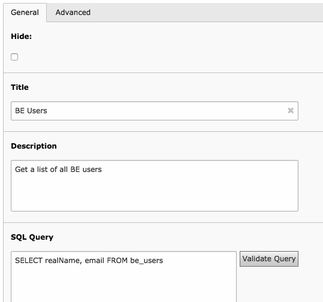

.. ==================================================
.. FOR YOUR INFORMATION
.. --------------------------------------------------
.. -*- coding: utf-8 -*- with BOM.

.. include:: ../../Includes.txt

.. _tutorial-database:

Querying the database
^^^^^^^^^^^^^^^^^^^^^

As a first step we will use Data Query to get a list of all BE users.
We want to display their names and email addresses so that the web
site users can contact them easily. Create a new "Data Queries" record
and type in the SQL query:

.. code-block:: sql

	SELECT realName, email FROM be_users

With some metadata added, you should have a result like:

	A sample Data Query element with SQL query to retrieve all BE users

Data Query takes care of all "special" fields automatically,
so you don't need to care about them. In this case it will
transparently handle the "disabled" field meaning that disabled BE
users will not be listed, although we didn't specify this condition
explicitly in the SQL query.

.. warning::

   Be sure to type the query as it appears above
   with the SQL keywords in uppercase. Data Query requires
   SQL keywords to be in uppercase.

Let's not worry about the other properties for now. Just save and
close the Data Query record.

