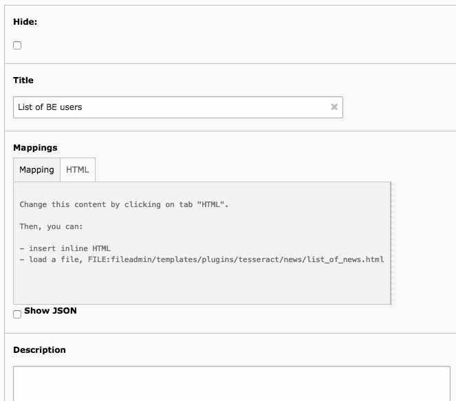
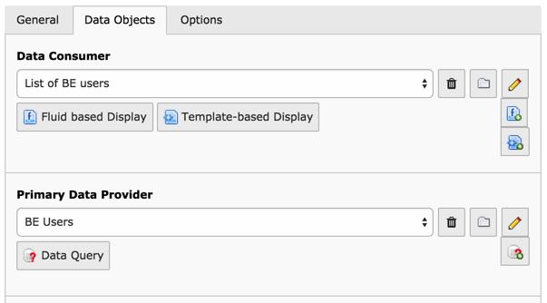
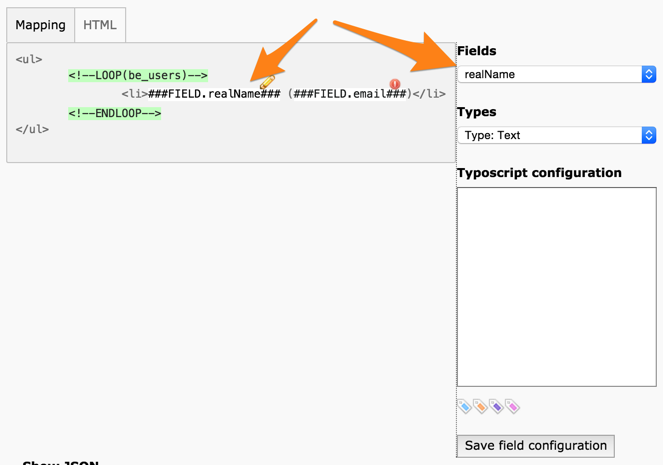
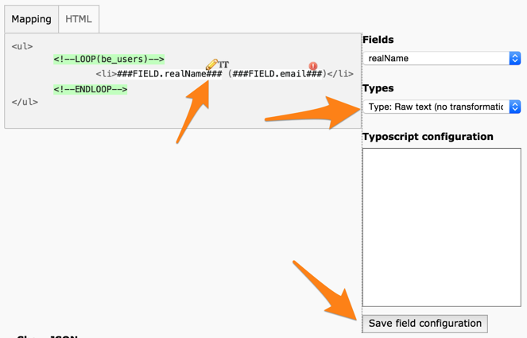
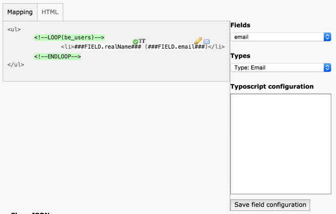
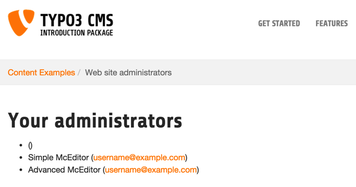

.. ==================================================
.. FOR YOUR INFORMATION
.. --------------------------------------------------
.. -*- coding: utf-8 -*- with BOM.

.. include:: ../../Includes.txt

.. _tutorial-fitting-together:

Fitting it all together
^^^^^^^^^^^^^^^^^^^^^^^

It is finally time to use the Display Controller itself. Move to the
Web > Page module and create a new "Display Controller (cached)" by
choosing from the new content element wizard:

	Choosing a Display Controller-type plugin from the new content element wizard

See the User's manual chapter for a discussion on the
difference between the :ref:`cached and non-cached versions <user-display-cache>`.

Switch to the "Data Objects" tab to create the relations between the
components we defined earlier. For the "Data Consumer" select the
"Template-based Display" record that we just created. For the "Primary
Data Provider" select the "Data Queries" record created in the first
step. Click on the "Save" button. Your screen should look like this:

	Setting up the Display Controller with the previously defined components

Now the "Template-based Display" record has been set in
relation with the "Data Queries" record via the Display Controller.
It's time to edit the "Template-based Display" record and define the
relations between the database fields and the template markers.

Edit the "Template-based Display" record and click on the :code:`###FIELD.realName###`
marker. Notice the drop-down menu that has appeared on the right side.
Also note that the "realName" field is preselected in this drop-down
menu. That's because the marker used the exact same name as the
database field.

	Mapping the "realName" field in the Template Display's mapping interface

Below the "fields" drop-down menu is another selector called
"Types". This defines how the field should be rendered. You will
notice that some items in this selector bear names that resemble
TypoScript content objects. This is no coincidence. For example a
field of type "text" will be rendered using a TEXT object. The box
below the selector allows you to enter TypoScript corresponding to the
type that you selected. The :ref:`Template Display manual <templatedisplay:start>`
has a list of all types and their corresponding TypoScript objects or functions.

In this case we don't want to do anything special with the
administrator's name, so we don't need any TypoScript rendering. Hence
we choose the "Raw text (no transformation)" type and click the "Save
field configuration" button below the TypoScript configuration field.

	After being mapped, the field is marked with an icon indicating its type

.. note::

   Notice how the little icon next to the pencil changed after clicking
   on "Save field configuration". This is a quick visual clue as to the
   type of the field.

Let's move on to the next field where we will use some TypoScript.
Indeed we want the e-mail address to be clickable. So the steps to
take are:

#. click on the ###FIELD.email### marker

#. verify that the "email" field is indeed selected in the "Fields"
   selector

#. choose the type "Email" from the "Types" selector

#. click on "Save field configuration"

Your display should look like this:

	Mapping the "email" field in the Template Display's mapping interface

The "Email"-type field corresponds to a :ref:`typolink <t3tsref:typolink>` function.
It expects that the field it is mapped to contains an e-mail address,
otherwise it will just create a typolink to whatever else.

We are ready for the big jump! Save and close the edit window and then
view the page we have been working on. You should see a list of BE
users with a clickable e-mail address (the screenshot is based on a
clean TYPO3 CMS installation with the official Introduction Package):

	The result of our work in the frontend

What's wrong with the first line? That's quite simple: this
BE user has no real name and no e-mail address defined. This gives us
a good opportunity to improve our example.

