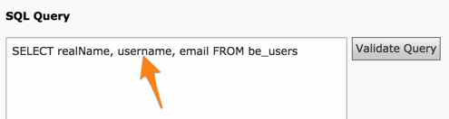
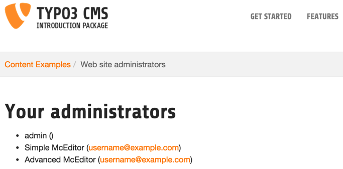

.. ==================================================
.. FOR YOUR INFORMATION
.. --------------------------------------------------
.. -*- coding: utf-8 -*- with BOM.

.. include:: ../../Includes.txt

.. _tutorial-improving-display:

Improving the display
^^^^^^^^^^^^^^^^^^^^^

A first approach could to just filter out users that have no real name
or e-mail address in the SQL query itself. This is a bit rough. We can
do better with some more TypoScript in the display.

First of all let's edit the SQL query so that we have the username at
disposal too. Edit the "Data Queries" record and add the "username"
field to the list of selected fields:

	Improved SQL query in the Data Query element

Now let's edit the "Template-based Display" record again. We want to
achieve the following: if the real name is not defined, we want to
display the username instead. This will be possible only with
TypoScript so we have to change the type of the "realName" field to
"text" and then enter the following TypoScript:

.. code-block:: typoscript

   ifEmpty.field = username

	Changing the type and adding TypoScript for the "realName" field mapping

.. important::

   Don't forget to click the "Save field
   configuration" button every time you make a change either to the
   "Fields" selector, the "Types" selector or the "TypoScript
   configuration" field.

Let's look at the result in the frontend:

	The improved result in the frontend

The username has indeed replaced the real name for the first user.

How was that possible? For each record handled inside the loop,
Template Display loads all fields from the record into the local
content object used for rendering. Thus every field is available in
the :code:`field` property of stdWrap. This makes it very easy to use the
data from the database to create sophisticated renderings. In this
case we are using this together with the :code:`ifEmpty` property, so that
the username gets displayed when the real name is blank.

The second improvement would be to avoid displaying empty brackets
when no e-mail address is defined. This is left as an exercise to the
reader. The answer can be found in :ref:`Appendix A – Tutorial answers <appendix-a>`.
Just a hint:

- the "Email"-type field corresponds to a typolink function. This
  implies that we will not have the TypoScript available to avoid
  displaying empty brackets. The type of the field will have to be
  changed and the "mailto:" link built differently. And the HTML
  template has to be changed too, of course.

The result should be as follows:

.. figure:: ../../Images/Tutorial/FinalTutorialResult.png
	:alt: The tutorial's final result

	The final result in the frontend, with empty brackets removed
