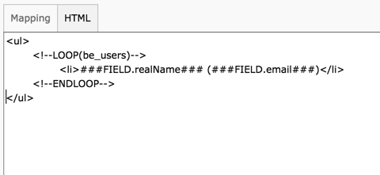
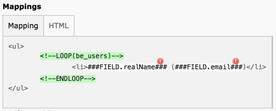

.. ==================================================
.. FOR YOUR INFORMATION
.. --------------------------------------------------
.. -*- coding: utf-8 -*- with BOM.

.. include:: ../../Includes.txt

.. _tutorial-template:

Preparing a template for display
^^^^^^^^^^^^^^^^^^^^^^^^^^^^^^^^

The next step is to start preparing the display for the results of our
query. To achieve this, create a new record of type Template-based
Display. Just enter a title and save. You should have a screen that
looks like this:

.. figure:: ../../Images/Tutorial/TemplateDisplayMetadata.png
	:alt: First step with templatedisplay

	A Template Display element with just a title

The main action happens in the mapping "Fields". At the
moment there's nothing we can do in the "Mapping" tab, but we can
switch to the "HTML" tab and start defining a template for displaying
the list of BE users. Enter the following HTML:

.. code-block:: html

	<ul>
		<!--LOOP(be_users)-->
			<li>###FIELD.realName### (###FIELD.email###)</li>
		<!--ENDLOOP-->
	</ul>

in the HTML tab.

	Inserting the HTML code in the Template Display element

The basic idea is to display the BE users as a bulleted list.
So the first step is to open and close a :code:`<ul>` tag. Inside that tag we
define a loop on the "be\_users" table, using the syntax which is
explained in more details in the manual of the Template Display
extension. Inside the loop, we create a :code:`<li>` tag for each user and
decided to display the name and the email side-by-side, the email
being wrapped in brackets.

We can move back the the "Mapping" tab. The HTML that we just entered
is saved in the background. You should now have the following view:

	The mapping tab with unmapped fields

As you can see that HTML was parsed and some elements were
recognized and highlighted: the loop and the "field markers". Those
markers are where the data from the database will come. They currently
have warning icons over them because they are not yet related to a
database field, even though the use the same name. In the current
situation, the "Data Queries" record that we created in the previous
step and the template are not related in any way.

In the next step we will define the actual content element and make
the relation between the query and the template. For now you can save
and close the "Template-based Display" record.

