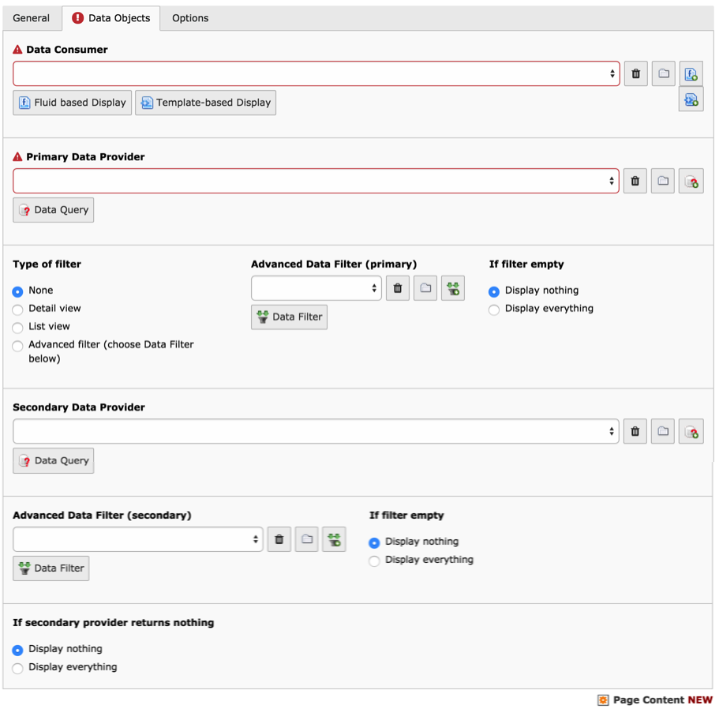

.. ==================================================
.. FOR YOUR INFORMATION
.. --------------------------------------------------
.. -*- coding: utf-8 -*- with BOM.

.. include:: ../../Includes.txt

.. _user-display-controller:

The Display Controller
^^^^^^^^^^^^^^^^^^^^^^

This section describes all the options available when creating a new
Display Controller content element.

	A new Display Controller element with all possible options

.. _user-display-controller-data-consumer:

Data Consumer
"""""""""""""

This is a reference to a Data Consumer record. The field provides
wizards for selecting a record, edit the current record or create a
new Data Consumer (one such wizard appears per available Data Consumer
type). This field is required as nothing will be display otherwise.

.. _user-display-controller-primary-data-provider:

Primary Data Provider
"""""""""""""""""""""

This is a reference to the Data Provider that will fetch the data to
display. The field provides wizards for selecting a record, edit the
current record or create a new Data Provider (one such wizard appears
per compatible Data Provider type). This field is required as nothing
will be displayed otherwise.

Type of filter
''''''''''''''

Choose the type of filter to apply to the Data Provider. The "Detail
view" and "List view" options will tell the Display Controller to
define a filter using the default GET/POST variable names for both
views. Check the "Advanced filter" option if you want to apply a Data
Filter record, which has to be selected separately (see below).

.. warning::

   Predefined filters will be dropped in future versions of
   Display Controller. Please don't rely on them anymore.

Advanced Data Filter (primary)
''''''''''''''''''''''''''''''

This is a reference to a Data Filter record that will apply to the
Primary Data Provider. The field provides wizards for selecting a
record, edit the current record or create a new Data Filter (one such
wizard appears per available Data Filter type).  *In order for this
filter to be active, it is also necessary to select "Advanced filter"
from the "Type of filter" field* (see above).

If filter empty
'''''''''''''''

With this field you can choose the behavior of the Display Controller
when the filter results in no conditions at all. This may happen with
a search field, for example: when the use submits an empty search, the
filter will also be empty. You must then choose whether you want to
display everything or nothing in such a case.

.. _user-display-controller-secondary-data-provider:

Secondary Data Provider
"""""""""""""""""""""""

This is a reference to the Data Provider that feeds into the Primary
Provider. The field provides wizards for selecting a record, edit the
current record or create a new Data Provider (one such wizard appears
per compatible Data Provider type).

The Secondary Data Provider is meant to return lists of primary keys
which will then restrict the list of records returned by the Primary
Data Provider.

A Data Filter can be applied to the Secondary Data Provider too. The
same choice as described above must be made in case that filter ends
up being empty.

.. _user-display-controller-secondary-nothing:

If secondary provider returns nothing
"""""""""""""""""""""""""""""""""""""

As with Data Filters it is necessary to define the behavior of the
Display Controller should the Secondary Data Provider (if defined)
return nothing. Here again the choice is to display either everything
or nothing.

